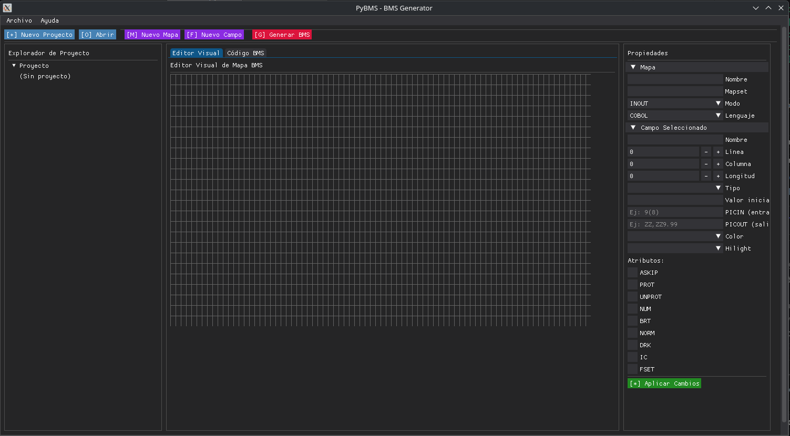
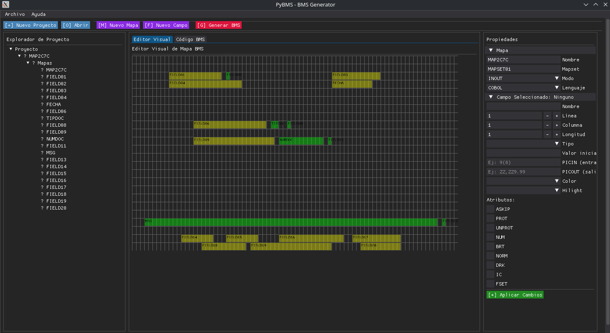

# PyBMS - Python BMS Generator

Una herramienta completa para generar mapas BMS (Basic Mapping Support) para sistemas mainframe CICS, desarrollada en Python usando DearPyGUI.

## 🚀 Preview

### Interfaz Principal


*Vista general de la interfaz de PyBMS mostrando el editor visual con grid 24x80, panel de propiedades y explorador de proyecto.*

### Editor de Campos BMS


*Editor de propiedades de campos BMS con vista previa del código generado automáticamente.*

## 💻 Desarrollo

### Requisitos para desarrollocipales

- **Generador de mapas BMS**: Crea mapas para pantallas mainframe CICS
- **Editor visual**: Diseño visual de formularios y pantallas con grid 24x80
- **Selección única**: Sistema inteligente de selección de campos en el explorador
- **Validación automática**: Detección automática de contenido BMS válido
- **Carga flexible**: Acepta archivos con cualquier extensión
- **Interfaz gráfica moderna**: Usando DearPyGUI con paneles integrados
- **Generación de código**: Genera código BMS válido automáticamente

## 📁 Estructura del Proyecto

```
PyBMS/
├── main.py                     # 🚀 Punto de entrada principal
├── src/                       # 📚 Código fuente
│   ├── gui/                   # 🖥️ Interfaz gráfica DearPyGUI
│   │   └── main_window.py     # Ventana principal con editor visual
│   ├── bms/                   # ⚙️ Generador de código BMS
│   │   └── generator.py       # Lógica de generación y validación
│   ├── models/                # 📋 Modelos de datos BMS
│   │   └── __init__.py        # BMSProject, BMSMap, BMSField
│   └── utils/                 # 🛠️ Utilidades y configuración
│       └── config.py          # Configuración persistente
├── requirements.txt           # 📦 Dependencias
└── README.md                 # 📖 Esta documentación
```

## 🛠️ Instalación

### Prerrequisitos

- Python 3.8+
- pip (gestor de paquetes de Python)

### Pasos de instalación

1. **Clonar el repositorio**:

   ```bash
   git clone <repository-url>
   cd PyBMS
   ```
2. **Crear entorno virtual** (recomendado):

   ```bash
   python -m venv .venv
   source .venv/bin/activate  # En Windows: .venv\Scripts\activate
   ```
3. **Instalar dependencias**:

   ```bash
   pip install -r requirements.txt
   ```

## 🎯 Uso Rápido

### Ejecutar la aplicación GUI

```bash
python main.py
```

### Ejemplo programático básico

```python
from src.models import BMSProject, BMSMap, BMSField, FieldType, FieldAttribute
from src.bms import BMSGenerator

# Crear proyecto
project = BMSProject(name="Mi Proyecto")

# Crear mapa
mapa = BMSMap(name="TESTMAP", mapset_name="TESTSET")

# Añadir campo
campo = BMSField(
    name="TITULO",
    line=1,
    column=30,
    length=20,
    field_type=FieldType.LABEL,
    initial_value="PANTALLA DE PRUEBA"
)
mapa.add_field(campo)

# Generar código BMS
generator = BMSGenerator()
codigo_bms = generator.generate_map_code(mapa)
print(codigo_bms)
```

## 🔧 Funcionalidades Avanzadas

### 1. Sistema de Selección Única

- **Navegación intuitiva**: Click en campos del explorador para seleccionar
- **Sincronización automática**: Propiedades se actualizan automáticamente
- **Prevención de errores**: Solo un campo puede estar seleccionado a la vez
- **Estado visual claro**: Campo seleccionado destacado en amarillo

### 2. Validación Inteligente de Archivos

- **Carga universal**: Acepta archivos con cualquier extensión (.bms, .txt, .dat, etc.)
- **Detección automática**: Valida contenido BMS basado en patrones y palabras clave
- **Criterios de validación**:
  - Palabras clave BMS: DFHMSD, DFHMDI, DFHMDF
  - Patrones de campo: POS= con LENGTH= o ATTRB=
  - Mínimo 2 indicadores BMS y al menos una definición de campo
- **Alertas informativas**: Notificación cuando archivos no son BMS válidos
- **Carga forzada**: Opción para cargar archivos de todos modos

### 3. Editor Visual Completo

- **Grid 24x80**: Representación exacta de pantalla mainframe
- **Panel de propiedades**: Edición de atributos de campos y mapas
- **Explorador de proyecto**: Vista de árbol con mapas y campos
- **Generación en tiempo real**: Código BMS actualizado automáticamente
- **Botón "Aplicar Cambios"**: Sincronización manual cuando sea necesario

### 4. Generación de Código BMS

El sistema genera código BMS válido siguiendo las especificaciones IBM:

```
LOGINSET DFHMSD TYPE=&SYSPARM,MODE=INOUT,LANG=COBOL,
           TERM=3270-2,CTRL=(FREEKB,FRSET),STORAGE=AUTO
LOGINMAP DFHMDI SIZE=(24,80)
TITULO DFHMDF POS=(2,25),LENGTH=30,ATTRB=(BRT),INITIAL='SISTEMA DE VENTAS V1.0'
USUARIO DFHMDF POS=(8,26),LENGTH=8,ATTRB=(UNPROT,IC)
PASSWORD DFHMDF POS=(10,28),LENGTH=8,ATTRB=(UNPROT,DRK)
MENSAJE DFHMDF POS=(15,10),LENGTH=60,ATTRB=(BRT)
DFHMSD TYPE=FINAL
         END
```

## 📚 Modelos de Datos

### BMSProject

Contenedor principal que puede tener múltiples mapas BMS.

### BMSMap

Representa un mapa BMS individual con:

- Nombre del mapa y mapset
- Tamaño (líneas x columnas)
- Colección de campos
- Atributos del mapa (modo, lenguaje, terminal)

### BMSField

Campos individuales con:

- Posición (línea, columna)
- Longitud y tipo de campo
- Atributos BMS (UNPROT, BRT, NORM, etc.)
- Valor inicial y propiedades

### FieldType (Enum)

Tipos de campo soportados:

- `LABEL`: Etiquetas de texto
- `INPUT`: Campos de entrada
- `OUTPUT`: Campos de salida
- `PROTECTED`: Campos protegidos
- `NUMERIC`: Campos numéricos
- `UNPROTECTED`: Campos no protegidos

### FieldAttribute (Enum)

Atributos BMS estándar:

- `ASKIP`: Auto skip
- `PROT`: Protected
- `UNPROT`: Unprotected
- `NUM`: Numeric
- `BRT`: Bright
- `NORM`: Normal
- `DRK`: Dark
- `IC`: Insert cursor
- `FSET`: Field set

## 🔄 Flujo de Trabajo

1. **Crear/Abrir proyecto**: Nuevo proyecto o cargar archivo existente
2. **Diseñar mapa**: Añadir campos usando el editor visual
3. **Configurar propiedades**: Usar panel de propiedades para personalizar
4. **Validar**: El sistema valida automáticamente la estructura
5. **Generar código**: Obtener código BMS listo para el mainframe
6. **Guardar**: Exportar proyecto para uso posterior

## �‍💻 Desarrollo

### Requisitos para desarrollo

- Python 3.8+
- DearPyGUI 1.11.1+
- Conocimientos básicos de BMS/CICS

### Arquitectura

El proyecto sigue una arquitectura modular:

- **Modelos**: Lógica de negocio y estructuras de datos
- **Generador**: Lógica de creación de código BMS
- **GUI**: Interfaz de usuario con DearPyGUI
- **Utilidades**: Configuración y helpers

### Contribuir

1. Fork el repositorio
2. Crea una rama para tu feature: `git checkout -b feature/nueva-funcionalidad`
3. Commit tus cambios: `git commit -m 'Añadir nueva funcionalidad'`
4. Push a la rama: `git push origin feature/nueva-funcionalidad`
5. Envía un pull request

## 📋 Dependencias

### Principales

- **DearPyGUI**: Interfaz gráfica moderna
- **Python**: 3.8+ requerido

### Incluidas en Python estándar

- **pathlib**: Manejo de rutas
- **dataclasses**: Modelos de datos
- **enum**: Enumeraciones tipadas
- **typing**: Hints de tipos

## 📞 Soporte

Si encuentras algún problema o tienes sugerencias:

1. Verifica que tienes las dependencias correctas instaladas
2. Consulta la documentación de las funcionalidades específicas
3. Revisa que el archivo tenga contenido BMS válido

## 📄 Licencia

Este proyecto está disponible bajo los términos especificados en el archivo LICENSE.

## 🙏 Agradecimientos

- Basado en las especificaciones IBM BMS para CICS
- Interfaz gráfica powered by DearPyGUI

---

**PyBMS - Simplificando la creación de mapas BMS para mainframe** 🖥️✨
